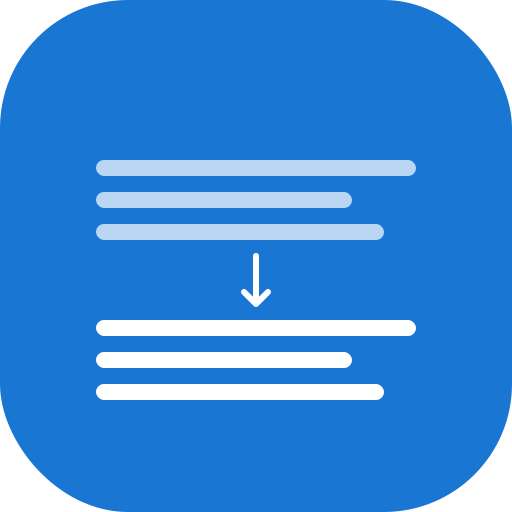

<div align="center">
  
  <h1>textmodifiers</h1>
</div>

[](https://opensource.org/licenses/MIT)
[](https://reactjs.org/)
[](https://www.typescriptlang.org/)
[](https://mui.com/)
[](https://vitejs.dev/)
[](https://nodejs.org/)
[](http://makeapullrequest.com)
[](CONTRIBUTING.md)
[](https://github.com/novasuitelabs/textmodifiers/issues)
[](https://github.com/novasuitelabs/textmodifiers/pulls)
[](https://github.com/novasuitelabs/textmodifiers/stargazers)
[](https://github.com/novasuitelabs/textmodifiers/network)
[](https://github.com/novasuitelabs/textmodifiers/blob/main/LICENSE)
[](https://github.com/novasuitelabs/textmodifiers/commits/main)
[](https://github.com/novasuitelabs/textmodifiers/actions/workflows/deploy.yml)

A modern, web-based text transformation tool built with React, TypeScript, and Material UI 3. Transform your text with various formatting options, case changes, and text analysis features.

## 🔗 Quick Links

[](https://novasuitelabs.github.io/textmodifiers)
[](https://github.com/novasuitelabs/textmodifiers#readme)
[](https://github.com/novasuitelabs/textmodifiers/blob/main/.github/CONTRIBUTING.md)
[](https://github.com/novasuitelabs/textmodifiers/issues)
[](https://github.com/novasuitelabs/textmodifiers/discussions)

## ✨ Features

### Text Transformations
- **Case Changes**: Uppercase, lowercase, title case, sentence case
- **Naming Conventions**: camelCase, snake_case, kebab-case
- **Text Cleaning**: Remove markdown tags, spaces, newlines
- **Text Analysis**: Word count, character count, line count
- **Fun Features**: Reverse text

### AI-Powered Tools (NEW!)
- **Floating AI Sidebar**: Access AI tools from anywhere with a beautiful floating interface
- **Glowing Ring Animation**: Eye-catching animated button with smooth transitions
- **Text Summarization**: Create concise summaries of your text
- **Grammar Correction**: Fix grammar, spelling, and improve writing style
- **Style Transfer**: Transform text to different writing styles (professional, casual, formal, etc.)
- **Language Translation**: Translate text to multiple languages
- **Text Analysis**: Get detailed insights about tone, style, and themes
- **Content Expansion**: Add more detail and examples to your text
- **Content Generation**: Create new content based on topics
- **Custom AI Prompts**: Use your own custom prompts for AI processing
- **Real-time Streaming**: Toggle streaming mode for word-by-word AI responses
- **Powered by Azure OpenAI Service**: Leveraging GPT-4.1-nano for advanced text processing

### User Experience
- 🎨 **Material UI 3** with expressive design
- 🌙 **Auto dark mode** detection based on system preference
- 📱 **Responsive design** for all devices
- 📋 **Copy to clipboard** functionality
- 💾 **File upload/download** support
- 🔔 **Toast notifications** for user feedback
- 📝 **Sample Texts** with 8 different categories for testing AI features

## 🚀 Getting Started

### Prerequisites
- Node.js (version 16 or higher)
- npm or yarn
- GitHub Personal Access Token (for AI features) - supports both fine-grained and classic tokens

### Installation

1. Clone the repository:
```bash
git clone https://github.com/novasuitelabs/textmodifiers.git
cd textmodifiers
```

2. Install dependencies:
```bash
npm install
```

3. Set up environment variables:
   - Create a `.env` file in the root directory
   - Add your GitHub Personal Access Token:
   ```
   VITE_GITHUB_TOKEN=your_github_token_here
   ```
   - Get your token from: https://github.com/settings/tokens
   - **Recommended**: Use fine-grained tokens for better security
   - See [ENVIRONMENT_SETUP.md](ENVIRONMENT_SETUP.md) for detailed setup instructions

4. Start the development server:
```bash
npm run dev
```

5. Open your browser and navigate to `http://localhost:3000`

## 🛠️ Available Scripts

- `npm run dev` - Start development server
- `npm run build` - Build for production
- `npm run preview` - Preview production build
- `npm run lint` - Run ESLint

## 📦 Tech Stack

- **Framework**: React 18 with TypeScript
- **Build Tool**: Vite
- **UI Library**: Material UI 3
- **Styling**: Emotion (CSS-in-JS)
- **Icons**: Material Icons
- **Deployment**: GitHub Pages ready

## 📊 Project Status

[](https://github.com/novasuitelabs/textmodifiers/actions)
[](https://github.com/novasuitelabs/textmodifiers)
[](https://github.com/novasuitelabs/textmodifiers)
[](https://github.com/novasuitelabs/textmodifiers)
[](https://github.com/novasuitelabs/textmodifiers)
[](https://github.com/novasuitelabs/textmodifiers)

## 🎯 Usage

### Getting Started
1. **Choose Sample Text**: Select from 8 different text categories (Business, Creative, Academic, Technical, etc.)
2. **Randomize**: Use the shuffle button to get a random sample text
3. **Enter Custom Text**: Type or paste your own text in the input field
4. **Upload File**: Click "Upload File" to load text from a file (.txt, .md, .json, .csv)

### Basic Text Transformations
1. **Transform**: Click any transformation chip to apply the transformation
2. **Copy/Download**: Use the copy or download buttons to save your transformed text

### AI-Powered Tools
1. **Floating AI Button**: Click the glowing AI button on the right side of the screen
2. **Quick AI Actions**: Use the sidebar for common AI tasks like summarization and grammar correction
3. **Advanced AI Tools**: Access more advanced features like style transfer, translation, and content generation
4. **Expandable Interface**: Toggle between compact and expanded sidebar views
5. **Custom Prompts**: Create your own AI prompts for specialized text processing
6. **Real-time Processing**: Watch the AI process your text with loading indicators and error handling
7. **Azure OpenAI Integration**: Powered by Microsoft's Azure OpenAI Service with GPT-4.1-nano

## 🔧 Customization

### Adding New Transformations

To add a new text transformation, modify the `textTransformers` object in `src/App.tsx`:

```typescript
const textTransformers = {
  // ... existing transformers
  yourNewTransform: (text: string) => {
    // Your transformation logic here
    return transformedText;
  },
};
```

Then add it to the `transformationButtons` array:

```typescript
const transformationButtons = [
  // ... existing buttons
  { key: 'yourNewTransform', label: 'Your Transform Label' },
];
```

### Theme Customization

The app uses Material UI 3 theming. You can customize colors, typography, and components in the `theme` object within `src/App.tsx`.

## 🌐 Deployment

### GitHub Pages

1. Build the project:
```bash
npm run build
```

2. Push to GitHub and enable GitHub Pages in your repository settings

3. Set the source to "Deploy from a branch" and select the `gh-pages` branch

### Netlify

1. Connect your GitHub repository to Netlify
2. Set build command: `npm run build`
3. Set publish directory: `dist`
4. Deploy!

## 🤝 Contributing

1. Fork the repository
2. Create a feature branch: `git checkout -b feature/amazing-feature`
3. Commit your changes: `git commit -m 'Add amazing feature'`
4. Push to the branch: `git push origin feature/amazing-feature`
5. Open a Pull Request

## 📝 License

This project is licensed under the MIT License - see the [LICENSE](LICENSE) file for details.

## 🙏 Acknowledgments

- [Material UI](https://mui.com/) for the beautiful UI components
- [Vite](https://vitejs.dev/) for the fast build tool
- [React](https://reactjs.org/) for the amazing framework

## 📞 Support

If you have any questions or need help, please open an issue on GitHub.

---

Made with ❤️ by Nova Suite Labs using React and Material UI 3
